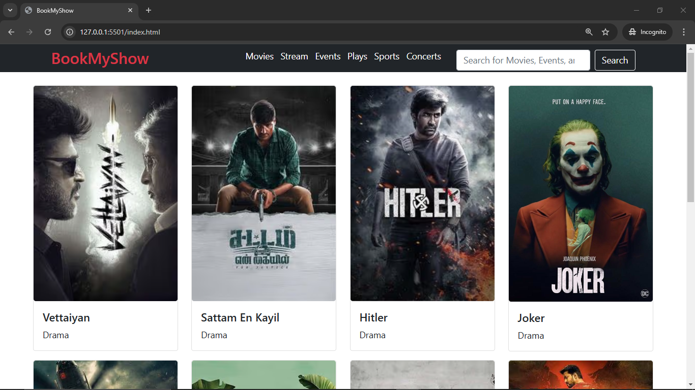
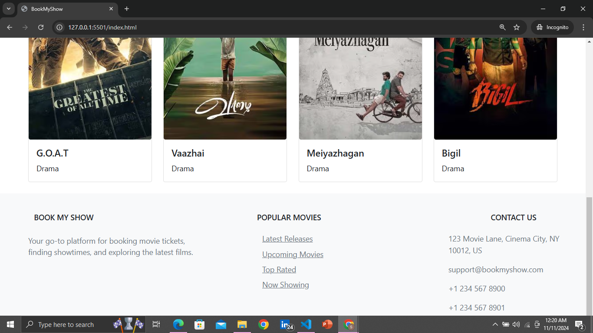

# BookMyShow Clone

This project is a simple web application that replicates the basic structure and features of the BookMyShow platform.
It showcases a responsive layout for booking movies, streaming events, and more, using HTML, CSS, and Bootstrap.

## Features

- **Header Section**: 
  - Logo, navigation menu (Movies, Stream, Events, Plays, Sports, Concerts), and a search bar for discovering content.
  
- **Movie Cards Section**: 
  - Displays a grid of movie cards with images, titles, and genres, showcasing different movies.
  
- **Footer Section**:
  - Includes the **Book My Show** information, popular movie links, and contact details.

- **Responsive Design**: 
  - The website is designed to be fully responsive using Bootstrap, making it functional on mobile, tablet, and desktop devices.

## Tech Stack

- **HTML**: Structure of the page.
- **CSS**: Styling of elements.
- **Bootstrap**: Used for responsive design and UI components.
- **JavaScript**: Not used in this version of the project, but can be added for interactivity.

## Setup Instructions

To view and use this website, follow these steps:

1. **Clone or Download** the repository:

    ```bash
    git clone https://github.com/sanjai104/BookMyShow_Clone.git
    ```

2. **Navigate** to the project folder:

    ```bash
    cd bookmyshow_clone
    ```

3. **Open** the `index.html` file in your preferred browser.

## Screenshots





## Contributions

Feel free to contribute to this project! You can:

- Suggest new features.
- Report bugs.
- Improve the design or functionality.
  
Please open an issue or submit a pull request with your contributions.

## License

This project is open-source and available under the [MIT License](LICENSE).

---

Enjoy browsing movies and events on this BookMyShow clone!
